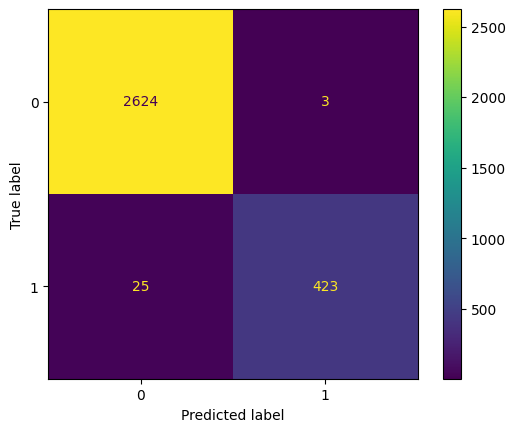

# Project Topic: Fraud Detection Application using EvaDB

## Introduction
[EvaDB](https://evadb.readthedocs.io/en/stable/index.html) enables software developers to build AI apps in a few lines of code. Its powerful SQL API simplifies AI app development for both structured and unstructured data. In this project, we build a basic fraud detection application with EvaDB using built-in [Ludwig](https://ludwig.ai/latest/) AI engine.

## Run the code
- Google Colab (Recommended)
  - [Run on Google Colab](https://colab.research.google.com/drive/1gpw23QHgX28aa7NjhdizdXgFtdapxyhV?authuser=2)
- Local Machine
  - `pip install -r requirements.txt`
  - `python -m run_evadb`

## Result
We load the [Credit Card Fraud Detection](https://www.kaggle.com/datasets/shubhamjoshi2130of/abstract-data-set-for-credit-card-fraud-detection?resource=download) into our PostgreSQL database.

This command will download the credit card fraud dataset from Kaggle after data cleaning.
The creditcard_fraud dataset contains over 3K records with 11 features and a binary label indicating whether a transaction was fraudulent or not.

The confusion matrix after training with Ludwig autoML

See more details in [tutorial](https://colab.research.google.com/drive/1gpw23QHgX28aa7NjhdizdXgFtdapxyhV?authuser=2)